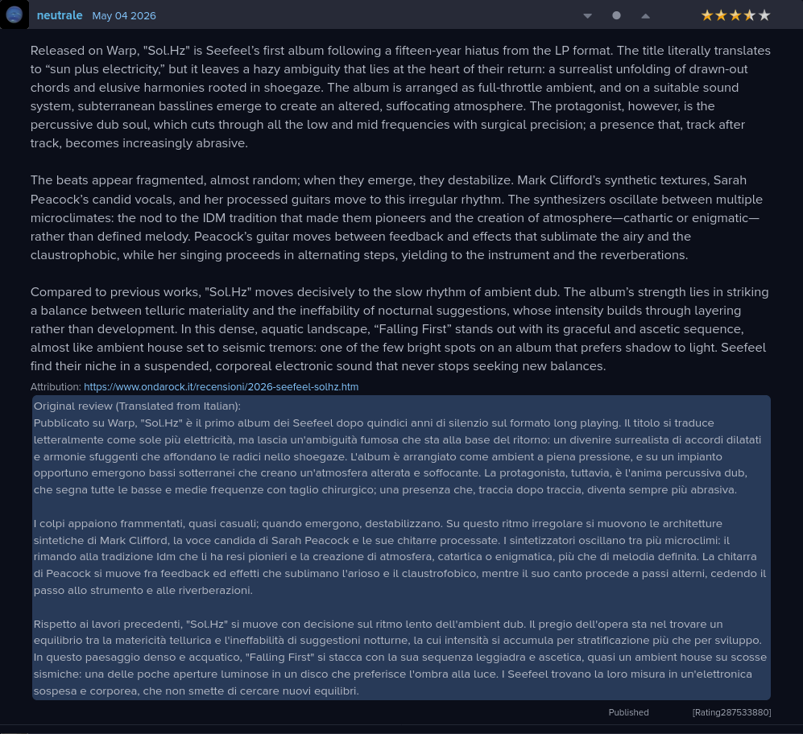
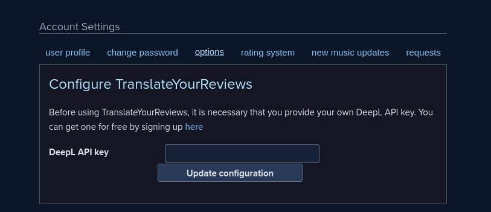

<div align="center">
    
    <h1>TranslateYourReviews</h1>
    <p>TranslateYourReviews is a browser extension that brings DeepL integration to reviews on RYM.</p>
    <a href="https://chromewebstore.google.com/detail/TranslateYourReviews/afidebkjbnljodfoleehhhendihaijlj">
        
    </a>
    <a href="https://addons.mozilla.org/en-US/firefox/addon/translateyourreviews/">
        
    </a>
</div>


## Features
* Release page UI integration
* DeepL API integration
* Translation caching
* Privacy-first (no credentials are kept)
* Site language detection


## Screenshots
<div align="center">


</div>


## Installation
### Local
Clone the repo
```sh
git clone https://github.com/compscitwilight/translateyourreviews
cd translateyourreviews
```

Install dependencies & build
```sh
npm install
npm run build
```

Load `dist/manifest.json` into your browser.
* On Firefox, navigate to `about:debugging`
* Click This Firefox > Load Temporary Add-on
* Select `manifest.json` in your dist directory

## Configuration
After installing the extension, navigate to your RateYourMusic <a href="https://rateyourmusic.com/account/preferences">account preferences page</a> and provide your DeepL API key in the new TranslateYourReviews configuration section.